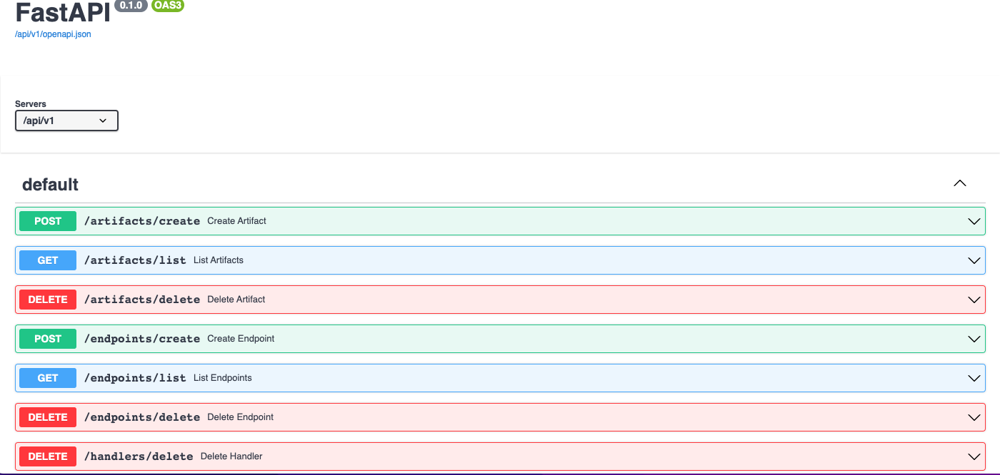

# FlightyAI

This is the source code for FlightyAI, an API for deploying ML models as REST APIs on your own Kubernetes cluster. Flighty is packaged as a [Helm chart](https://helm.sh/) for easy installation.

## Local setup

I test locally using Docker Desktop's built-in Kubernetes cluster. Start Docker Desktop and enable Kubernetes using the [instructions here](https://docs.docker.com/desktop/kubernetes/).

Run `kubectl get pods` to confirm Kubernetes is running.

### Deploying Flighty

Setup with: `./initialize_helm.sh`

The script [initialize_helm.sh](./initialize_helm.sh) creates a Kubernetes namespace called flighty-ai and then installs the [helm chart](./helm-chart/Chart.yaml) in that namespace. 

Set the namespace for convenience:

`kubectl config set-context --current --namespace=flighty-ai`
The pods will take some time to start. Run `kubectl get pods` to check their status.

When the pods are successfully, running, you will see:

```
NAME                           READY   STATUS      RESTARTS   AGE
controlplane-9d6dfccf6-jlbvf   2/2     Running     0          70s
db-upgrade-gb7zb               0/2     Completed   2          70s
mysql-6f46b8c6d8-xcjks         2/2     Running     0          70s
```


### Open up Swagger docss

Because we're using Istio, your control plane docs should now be available at 127.0.0.1/api/v1/docs:



### Deploying your first model

Follow the [instructions here](https://github.com/FlightyAI/flighty-sample) to deploy your first model.

To see a video demo of Flighty in action, check out [this video](https://www.loom.com/share/e0f5b13078b1482ba025cda26e0c2ef3).

### Cleaning up

Clean up with: `./clean-up_helm.sh`

The script [clean-up_helm.sh](./clean-up_helm.sh) uninstalls the Flighty Helm chart and deletes the flighty-ai namespace.


## Cloud setup (WIP, do not use)

### Create AKS cluster

`az group create --name AzureRg --location northcentralus`

```
az aks create -g AzureRg -n FlightyAKS \
--node-count 1 \
  --generate-ssh-keys \
  	--enable-cluster-autoscaler \
	--min-count 1 \
	--max-count 1
```

### Set correct kubeconfig and Azure context

```
k config use-context FlightyAKS
az account set --name 'Microsoft Azure Sponsorship'
az config set defaults.group=AzureRg

```

### Add spot node pool
```
az aks nodepool add \
    	--cluster-name FlightyAKS \
    	--name nodepool \
    	--node-vm-size Standard_A2_v2 \
    	--node-count 1 \
    	--node-osdisk-size 30 \
    	--enable-cluster-autoscaler \
    	--min-count 0 \
    	--max-count 3

```
Taint the system node pool so we only use spot node pool (I think this might resolve permissions issues in mySQL container)

`k taint nodes aks-nodepool1-31754575-vmss000000 CriticalAddonsOnly=true:NoSchedule`

### Connect to cluster:

`az aks get-credentials --resource-group AzureRg --name FlightyAKS `

Register Azure storage provider:

`az provider register --namespace Microsoft.Storage`


### Deploy with Helm

```
helm install flighty-cp helm-chart --namespace=flighty-ai
```
Then open up the URL
`127.0.0.1/api/v1/docs` and you should see the application. If you get a 503 saying 
  ```
  upstream connect error or disconnect/reset before headers. 
  reset reason: connection termination
  ```
  , 
what finally solved it for me was to just uninstall and reinstall istio.

#### Uninstalling and reinstalling istio

Uninstall istio: `istioctl x uninstall --purge`

Install again: `istioctl install`
Recreate gateway in default namespace: 

```
kubectl config set-context --current --namespace=default
kubectl apply -f istio-gateway.yaml
kubectl config set-context --current --namespace=flighty-ai
```

### Port-forward to check database is up

`kubectl port-forward service/mysql-external 3306:3306`

Query the database in MySQL workbench to confirm the database is now serving.


### Deploy and expose one-off service

```
kubectl create -f pod-create.yaml
kubectl port-forward service/test 8000:80  
```

Open the web UI at 127.0.0.1:8000/docs to see your service up and running.

### Install istio

#### (optional) Install kiali for monitoring

First install Prometheus for Istio add-on:
`kubectl apply -f https://raw.githubusercontent.com/istio/istio/release-1.14/samples/addons/prometheus.yaml`

```
helm install \
 --namespace istio-system \
  --set auth.strategy="anonymous" \
  --repo https://kiali.org/helm-charts \
  kiali-server \
  kiali-server
kubectl port-forward svc/kiali 20001:20001 -n istio-system
```

Note that kiali won't be able to schedule on spot node pool, so you'll need to edit the deployment to add:

```
      tolerations:
        - key: "kubernetes.azure.com/scalesetpriority"
          operator: "Equal"
          value: "spot"
          effect: "NoSchedule"
```

and then delete the pods to force this toleration to be applied.

#### Install and configure istio

Create the gateway
`kubectl create -f istio-gateway.yaml`

Add the virtual services:

`kubectl create -f virtual-service.yaml`
